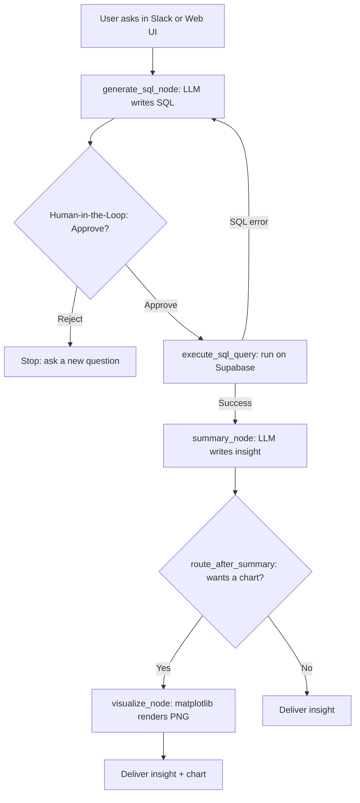
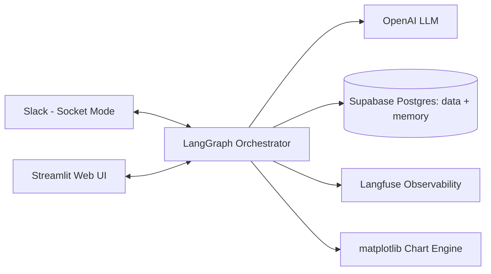

# 📊 Nexus Logistics AI Data Analyst

**A production-grade, Human-in-the-Loop Text-to-SQL agent with conversational memory, self-correction, and automated data visualization — delivered where teams already work: Slack and the web.**


## 🌍 The Company: Nexus Logistics Global

Nexus Logistics Global is a fictional worldwide supply-chain and e-commerce fulfillment giant — imagine Amazon meets FedEx. It moves millions of packages daily through automated fulfillment hubs and generates continuous data across **shipping, warehouse operations, and customer experience**.

This project gives Nexus what every real logistics company wants: **a safe, governed way for anyone to query company data in plain English — without writing a single line of SQL.**

---

## 🗄️ The Database

The agent queries a realistic analytical **Postgres** database (hosted on Supabase), seeded with deterministic, production-style data: **150 shipment orders across 90 days, 8 global fulfillment hubs, and 120 daily customer-experience snapshots.**

### 📦 `shipment_orders` — every package in the network
| Column | Type | Visualization fit |
|---|---|---|
| `order_id` | VARCHAR (PK) | — |
| `customer_id` | VARCHAR | — |
| `order_timestamp` | TIMESTAMP | 📈 Line (time axis) |
| `carrier_service` | VARCHAR | 🥧 Pie / 📊 Bar |
| `delivery_status` | VARCHAR | 🥧 Pie |
| `package_weight_kg` | NUMERIC | 📊 Bar |
| `shipping_revenue_usd` | NUMERIC | 📈 Line / 📊 Bar |
| `delivery_delay_minutes` | INTEGER | 📊 Bar |

### 🏢 `fulfillment_centers` — global warehouse hubs
| Column | Type | Visualization fit |
|---|---|---|
| `hub_id` / `hub_name` | VARCHAR | 📊 Bar (labels) |
| `global_region` | VARCHAR | 🥧 Pie |
| `total_active_robots` | INTEGER | 📊 Bar |
| `warehouse_capacity_pct` | NUMERIC | 📊 Bar |
| `daily_processed_packages` | INTEGER | 📊 Bar |

### 🙂 `customer_experience_metrics` — daily user & support telemetry
| Column | Type | Visualization fit |
|---|---|---|
| `snapshot_date` | DATE | 📈 Line (time axis) |
| `platform_type` | VARCHAR | 🥧 Pie |
| `support_ticket_category` | VARCHAR | 📊 Bar |
| `average_csat_score` | NUMERIC | 📈 Line |
| `active_users_count` | INTEGER | 📈 Line |

---

## 🤖 What the Agent Can Do

- **Plain-English → SQL:** Translates natural questions into safe, read-only `SELECT` queries using the live database schema.
- **Human-in-the-Loop governance:** Every query pauses and requires explicit ✅ Approve / ❌ Reject before touching the database.
- **Self-correction:** If SQL fails, the error is fed back to the LLM, which rewrites the query autonomously.
- **Conversational memory:** Remembers context across turns ("What about Sarah?" → knows who you mean). Survives server restarts via a Postgres checkpointer.
- **Automated visualization:** Detects chart intent and renders **bar / pie / line** charts with matplotlib, delivered inline.
- **Natural-language insights:** Raw rows are summarized into friendly, executive-ready answers.
- **Full observability:** Every LLM call, token, and latency is traced in **Langfuse**.
- **Two surfaces:** Lives in **Slack** (Socket Mode, interactive buttons) and as a **Streamlit web app**.

---

## 🏗️ Architecture

### Agent workflow


### System components


---

## ✅ Why This Is a Real-World, Production Project

| Concern | How it's solved |
|---|---|
| **Safety / governance** | HITL approval before every query; read-only SQL only |
| **Reliability** | Self-correction loop; persistent Postgres checkpointer survives restarts |
| **Scalability** | Connection pooling (`psycopg_pool`); Supabase transaction pooler |
| **Debuggability** | Langfuse tracing of prompts, tokens, latency, and failures |
| **Portability** | SQLAlchemy abstraction — swap DuckDB/Postgres/Snowflake by changing one URL |
| **Security** | Slack Socket Mode (outbound WebSocket, no public URL); secrets in env vars |
| **Deployment** | Cloud-hosted on Render (bot + web UI), Supabase, Langfuse Cloud |

---

## 🧪 Try It — Sample Questions

**Plain data:** "What is our total shipping revenue?" • "Which hub processes the most packages?" • "How many orders are delayed?"

**Bar:** "Show me a bar chart of daily processed packages by hub name"

**Pie:** "Show me a pie chart of shipment orders by delivery status"

**Line:** "Show me a line chart of total active users over time"

---

## ⚙️ Local Setup

```bash
pip install -r requirements.txt
```

`.env`:
```
OPENAI_API_KEY=...
DATABASE_URL=postgresql://...(Supabase transaction pooler)
SLACK_BOT_TOKEN=xoxb-...
SLACK_APP_TOKEN=xapp-...
LANGFUSE_PUBLIC_KEY=...
LANGFUSE_SECRET_KEY=...
LANGFUSE_HOST=https://cloud.langfuse.com
```

Run the surfaces:
```bash
python slack_bot.py      # Slack bot
streamlit run app.py     # Web UI
```

---

## 👨🏾‍💻 About the Author

Built by **Oladapo** — AI/Full-Stack Engineer specializing in production LLM systems, LangGraph orchestration, and data tooling. Open to freelance projects and full-time roles building enterprise AI agents.